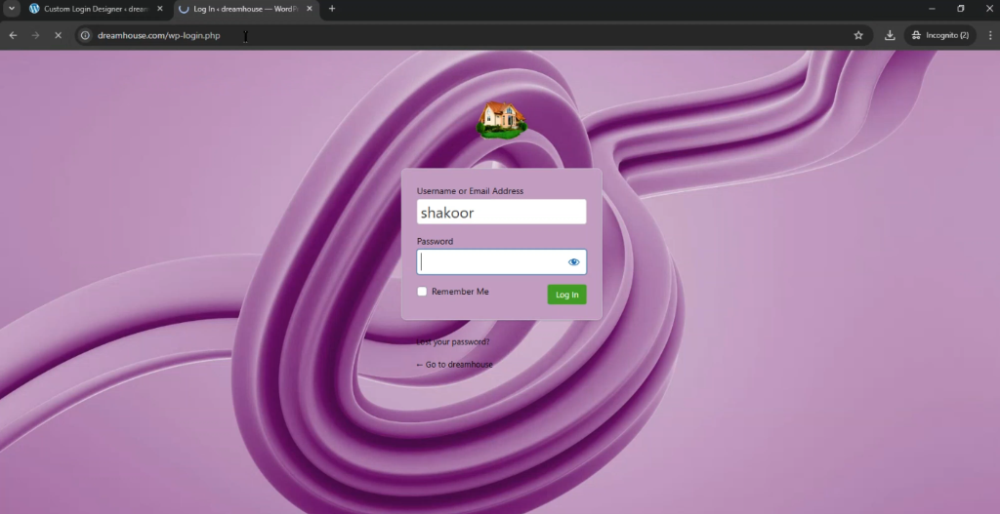

# WP Custom Login Designer

**WP Custom Login Designer** is a powerful and easy-to-use WordPress plugin that allows you to completely transform your WordPress login page. With its intuitive settings panel, you can customize backgrounds, logos, form styles, and buttons to match your brand's aesthetic without writing a single line of code.

## ✨ Features

- **General Settings**:
  - Enable or disable custom login styling with a single toggle.
  - Upload a custom logo to replace the WordPress default.
  - Precisely adjust logo width and height.
- **Background Customization**:
  - **Solid Color**: Choose any color using a built-in color picker.
  - **Gradients**: Create stunning backgrounds with start/end colors and adjustable directions (Diagonal, Horizontal, Vertical).
  - **Images**: Upload high-quality background images with support for cover/contain sizing and positioning.
- **Form Styling**:
  - Customize form background color, padding, and border radius.
  - Add or remove form shadows for a clean or modern look.
  - Style input fields with custom background, text, and border colors.
  - Change label colors for better readability.
- **Buttons & Links**:
  - Full control over button background, text, and hover colors.
  - Adjust button border-radius to match your design system.
  - Customize the color of "Lost your password?" and "Back to blog" links.
- **Custom CSS**:
  - Advanced users can inject their own CSS for ultimate flexibility.
- **Live Preview**:
  - See your changes in real-time with the integrated live preview tab.

## 🚀 How to Set Up

### Method 1: Manual Upload
1.  **Download** the plugin folder (`wp-custom-login-designer`).
2.  **Upload** the folder to your website's `/wp-content/plugins/` directory using FTP or your hosting file manager.
3.  **Log in** to your WordPress admin dashboard.
4.  Navigate to **Plugins** > **Installed Plugins**.
5.  Find **WP Custom Login Designer** and click **Activate**.

### Method 2: WordPress Dashboard
1.  Compress the `wp-custom-login-designer` folder into a `.zip` file.
2.  Go to **Plugins** > **Add New** in your WordPress dashboard.
3.  Click **Upload Plugin** at the top.
4.  Choose your `.zip` file and click **Install Now**.
5.  Once installed, click **Activate Plugin**.

## 🛠️ Usage
After activation, you will see a new menu item labeled **Login Designer** in your WordPress sidebar. Click it to access the customization dashboard. 

---
*Created by shakoor*
